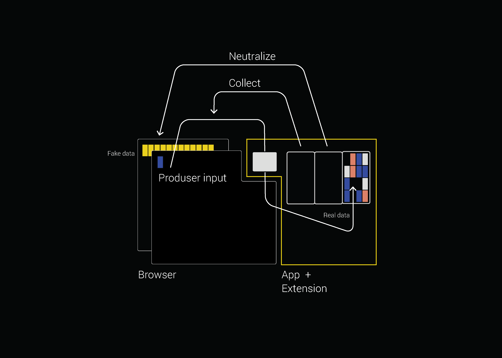

## Adil

### System for the communication and preservation of data value, its fair distribution and exchange.

Adil is a menubar desktop application for Mac OS that:

1. **Collects** data from Google Search to preserve produced data.
2. By generating fake Google Search requests it **neutralizes** data, that is collected by Google itself, so that only the Adil User has the real data set. The real data will always be only in the hands of the user.
3. At Adil’s stock **exchange** users have the possibility to trade produced data and its parts with interested companies, institutions and organizations for an exchange rate they find acceptable.



### Setup

```sh
# download repository
git clone https://github.com/goldsteinsveta/Adil
cd Adil

# install node modules
npm install

# run app
npm start

# export mac app
npm build
```
